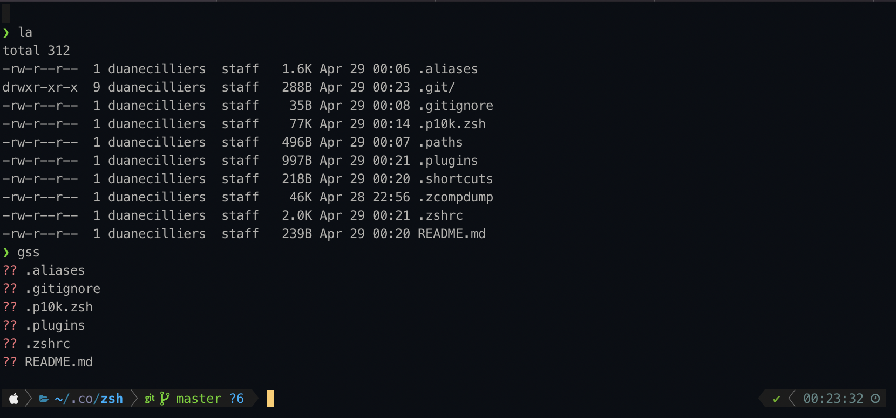

# My ZSH Config

I prefer to keep my ZSH config under `~/.config/zsh` by setting `export ZDOTDIR="$HOME/.config/zsh"` in `~/.zprofile`.

Want to use this config?

`git clone git@github.com:duanecilliers/zsh-config.git path/to/your/config`

